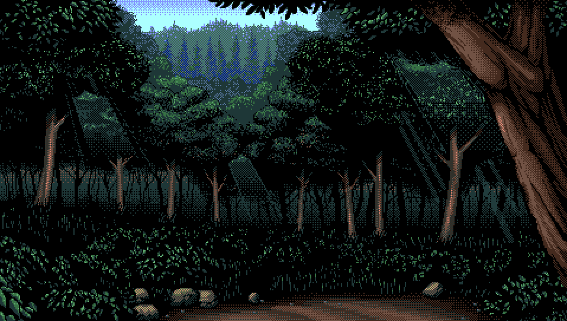

> A Computer Engineering student aspiring to be a game developer
---

## About Myself

I am *Patrick Cortez* and I go by the alias of Tezzz2026 online and I am a 3rd year computer engineering Student
in Iloilo City, Philippines. I am genuinely passionate about coding and I began coding about 2 years ago when
I was a 1st year student in college at the age of 20 just 2 months before I turned 21. Now I am 23 years and 
I plan to become a game,web and an app developer, basically anything that involves developing any kinds of software.

Though I am mostly into Game development. My first programming langauge was C++, I will never forget the first time
learning it. It was fun and exciting, because I had to solve problems logically in my code and implement features
I want to implement all by my self and how would I implement the said feature, overall it was exilirating. Then
after C++ it was with Visual Basic with WinForms, then Python,C#, Java, HTML, CSS, JavaScript, MySQL then I moved I learned
setting up Linux Servers and setting up any OS in any machine, then got to experience networking alongside it. Then over the
span of 2 years being a computer engineer, thought me alot, especially linux and hardware.

I am continuously learning more about technology everyday and its exciting to say the least.

## Technical Stack

| **Category** |  **Tools & Languages** | 
| :---         | :---                   |
| Languages 	 | C++, C#, Java, Python, MySQL, JavaScript, Bash, GDScript, JavaScript, Visual Basic|
| Development  | Visual Studio, VS Code, Nano, Vim,  Github Desktop, Git, CMake, Make, Docker |
| Game Development | Godot, Unity, Unreal Engine |
| Graphics & Design | Libreprite, Blender |
| App Development | Android Studio, Visual Studio |
| Networking | Docker, UDP/TCP, WebSockets, Headscale , Tailscale, ssh, Self-Hosted Services(Home server) |
| Hardware | Circuit analysis/Development , PC or Laptop repair/maintenance/Assembly, Phone repair/maintenance, Server maintenance and repair |
| Documentation | Obsidian, WPS |

## Focus

My current focus:

- **Development** : I'm mostly focused on making apps, games, low-level and any command-line tools.

- **Documentation** : I am very interested in writing documentation as well, so thats also one of my main focuses, writing
  docs in md, word and etc...

- **Art** : Since I am focused in game development I am also focused in drawing art or modeling 3d figures in blender or Libresprite.

- **Networking** : I am also very interested in networks and how other machines communicate at a distance, hence why I'm interested in Docker, VMS and VPS's
  and also self hosting services in my Linux Server.

- **Circuits and Hardware** ; As a Computer Engineer I am also focused on circuitry, As thats my one of my main focus as of right now.

## Socials

- Discord: @tezzzz69
- Reddit: https://www.reddit.com/user/Economy_Season_72
- Dev.to: https://dev.to/tezzz2026
- Email: patrickcortez736@gmail.com

